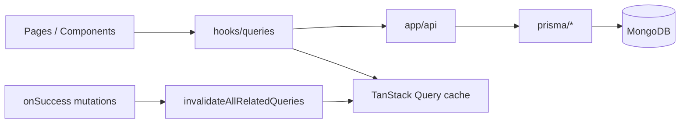

# PROJECT_WALKTHROUGH.md

Agent-oriented map of **stock-inventory** (Stockly). Last updated: 2026-05-19.

## 1. What this app is

Role-based inventory platform (admin / supplier / client): products, orders, invoices, warehouses, support tickets, Stripe, Shippo, Brevo, optional Redis cache and Sentry monitoring.

**Live:** <https://stockly-inventory.vercel.app/>

## 2. Repo map (high level)

```bash
app/              → pages + app/api/* route handlers
components/       → UI (ui/, Pages/, admin/, shared/, providers/)
hooks/queries/    → TanStack Query hooks + mutations
contexts/         → auth context
lib/              → api, auth, cache, email, monitoring, react-query, server, validations
prisma/           → schema + data access helpers
types/            → shared TS types
instrumentation.ts + instrumentation-client.ts → Sentry + Redis/QStash boot
```

## 3. Request & state flow



- **Reads:** query hooks → `lib/api` client → API routes → Prisma
- **Writes:** mutations → API → on success → `invalidateAllRelatedQueries` so lists/detail/dashboards refresh without full page reload
- **Prefetch / persistence:** configured in `lib/react-query/` (provider, keys, persister if enabled)

## 4. Product delete (implemented)

| Case | API | UI |
|------|-----|-----|
| Shipped/pending order | 409 + message | Toast shows error |
| Delivered/cancelled only | 200 `{ mode: "soft" }` | Archived toast; hidden from lists |
| Never ordered | 200 `{ mode: "hard" }` | Removed from DB |

- Filter: `lib/products/product-query.ts` → `deletedAt` null OR unset (legacy MongoDB rows)
- Tests: `npm run test` (delete-policy, prisma-errors, imagekit-errors)

## 5. Sentry monitoring (implemented)

| Layer    | File                                                          | Role                                                          |
| -------- | ------------------------------------------------------------- | ------------------------------------------------------------- |
| Config   | `lib/monitoring/sentry-config.ts`                             | DSN, tunnel `/api/monitoring`, scrubbing, sample rates        |
| Wrappers | `lib/monitoring/sentry.ts`                                    | `captureException`, `captureMessage`, user/breadcrumb helpers |
| Client   | `instrumentation-client.ts`                                   | `Sentry.init`, replay, browser tracing, tunnel                |
| Server   | `sentry.server.config.ts`                                     | Node/API/SSR                                                  |
| Edge     | `sentry.edge.config.ts`                                       | Edge runtime (if used)                                        |
| Boot     | `instrumentation.ts`                                          | Loads server/edge config; `onRequestError`                    |
| Build    | `next.config.ts`                                              | `withSentryConfig`, `tunnelRoute: /api/monitoring`            |
| Errors   | `app/global-error.tsx`, `components/shared/ErrorBoundary.tsx` | Uncaught + React errors                                       |
| API      | `lib/api/response-helpers.ts`                                 | 5xx → Sentry                                                  |
| Logs     | `lib/logger.ts`                                               | Production errors/warnings → Sentry                           |

**Verification checklist (manual):**

1. `NEXT_PUBLIC_SENTRY_DSN` + `SENTRY_DSN` set on Vercel → redeploy production
2. Browse prod site → Network tab shows POSTs to `/api/monitoring` (not blocked ingest host)
3. Sentry project **stock-inventory** → Issues / Performance show events within ~5 min

**Known gap:** `setUserContext` not hooked to login/session (errors are anonymous in Sentry until added).

**Wizard artifacts:** `.env.sentry-build-plugin` (gitignored) for local source map upload; `sentry.client.config.ts` is compatibility stub only.

## 6. Other optional integrations

| Service | Lib / entry                            | Env (optional)                  |
| ------- | -------------------------------------- | ------------------------------- |
| Redis   | `lib/cache/redis.ts`, `cache-utils.ts` | `UPSTASH_REDIS_*`               |
| QStash  | `lib/queue/qstash.ts`                  | `QSTASH_*`                      |
| Email   | `lib/email/`                           | `BREVO_*`                       |
| Stripe  | `lib/stripe/`                          | `STRIPE_*`                      |
| PostHog | Not implemented                        | See integration guide checklist |

Details: `docs/Redis_Sentry_PostHog_INTEGRATION_GUIDE.md`

## 7. Quality gates (audit 2026-05-19)

| Check | Status |
|-------|--------|
| `npm run lint` | pass |
| `npm run build` | pass |
| `npm run test` | 10 passed |
| Product delete | on main (883e74f+) |
| Sentry | on main |
| Hydration dates | `ClientDateDisplay` on detail pages + notifications |
| Vercel headers | `lib/vercel/production-headers.ts`; static cache only in `next.config.ts` |
| TanStack CRUD | `invalidateAllRelatedQueries` in mutation hooks |
| Python | N/A |

**Commit next:** product catalog fix (`isSet: false` + cache `v2` keys) — fixes empty product tables on prod.

**Gaps (OK):** export filters use `toLocaleDateString` (client export only); product QR/review id lookups; archived SKU unique; Sentry `setUserContext` optional.

**Manual QA:** order detail no hydration error; product delete 409/hard/soft.

## 8. When changing code

- **New API route:** use `successResponse` / `errorResponse`; 5xx auto-report if using helpers
- **New mutation hook:** call `invalidateAllRelatedQueries` on success (or document why not)
- **Sentry:** keep `SENTRY_TUNNEL_PATH` in sync in `sentry-config.ts` and `next.config.ts`
- **Env:** update `.env.example` + this file + `CLAUDE.md` if adding variables

## 9. Related docs

- `CLAUDE.md` — condensed agent rules
- `README.md` — user-facing setup and API list
- `docs/Redis_Sentry_PostHog_INTEGRATION_GUIDE.md` — step-by-step integrations
